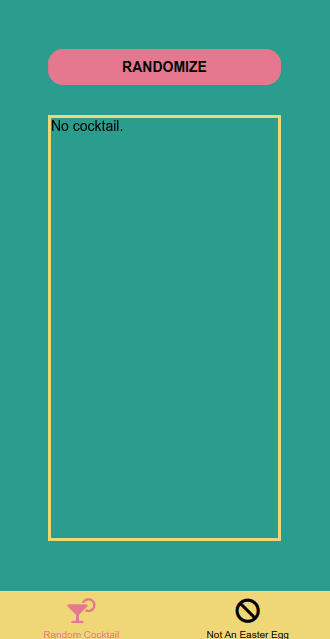
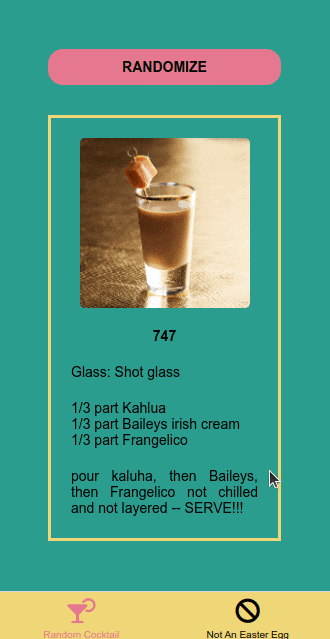
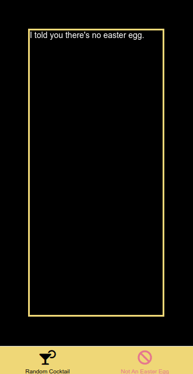

# Random Cocktail

**Project type:** Mobile application project.  
**Brief description:** Mobile application which uses an API and the accelerometer.  
**Technologies:** React Native.  

*Random Cocktail* is a mobile application made in React Native with Expo. It was developed during the bootcamp and the goal was to create a mobile app which uses an external API. The one I have picked is [thecocktaildb](https://www.thecocktaildb.com/).  

The app contains two tabs: "Random Cocktail" and "Not An Easter Egg". The first tab displays a random cocktail recipe obtained from the thecocktaildb API.

The other tab seems at first glance not to hold anything. Shaking the phone like a cocktail shaker, action recognized with the use of the accelerometer, reveals then the easter egg. A pop-up says "Shaken, Not Stirred." and James Bond's favorite cocktail appears.

<ins>A random cocktail</ins>  

<ins>No easter egg...</ins>  

<ins>...Unless?</ins>  

